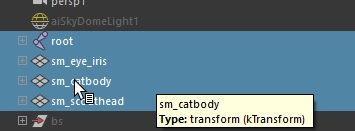
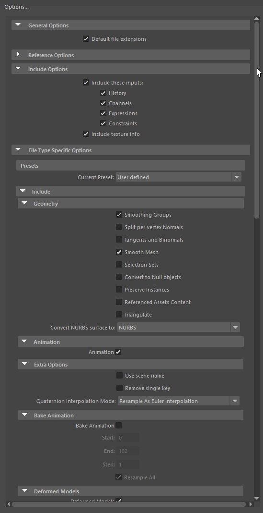
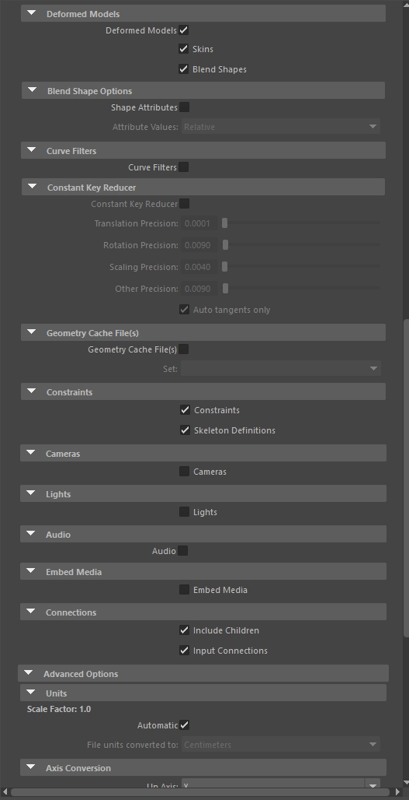
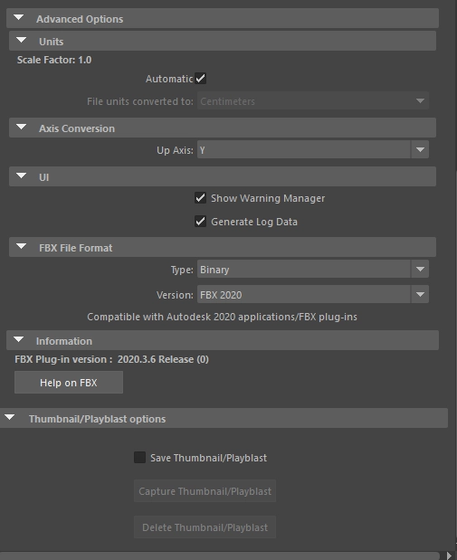

# Export Instructions

> Images referenced below live in `metadata/images/`. Add screenshots as you go —
> filenames match the placeholder paths exactly.

---

## Scarf & Cape — Skeletal Mesh / Leader Pose

Scarf and cape were rigged and animated in Maya. Because they deform with the
character's body, they use the **Modular Skeletal Mesh** workflow rather than the
static socket method used for the cap.

### 1. Key Difference

| Accessory | Method | Reason |
|-----------|--------|--------|
| Cap | Static Mesh + Socket | Rigid — attaches to one bone point, never deforms |
| Scarf / Cape | Skeletal Mesh + Leader Pose | Skinned — must bend with neck/spine and play back Maya animation |

---

### 2. Maya Export

**Keep world position.** Do not move scarf or cape to `0,0,0`. They must stay
exactly where they are on the character — they share coordinate space with the body mesh.

**Skeleton subset.** Export each piece with the joints it is actually bound to
(a subset of the main skeleton is fine). The hierarchy and bone names must match
the main character skeleton exactly.

**Export steps:**

1. Select the scarf mesh and the joints it is bound to.
2. `File → Export Selection` → format `FBX` → save as `SK_Scarf.fbx`.
3. Repeat for the cape: `SK_Cape.fbx`.


---

### 3. UE5 Setup — Leader Pose Workflow

#### 3a. Import

Import `SK_Scarf.fbx` and `SK_Cape.fbx` as **Skeletal Meshes**.
In the import dialog, set the **Skeleton** dropdown to the cat's existing Skeleton Asset.


#### 3b. Add Components

Open the Cat Character Blueprint. In the **Components** panel:

- Add a **Skeletal Mesh Component** → rename `ScarfMesh`
- Add a **Skeletal Mesh Component** → rename `CapeMesh`

Assign the imported assets to each component.


#### 3c. Construction Script — Set Leader Pose

In the **Construction Script**:

- Drag in `ScarfMesh` → wire into **Target** of a `Set Leader Pose Component` node
- Drag in `CapeMesh` → wire into **Target** of a second `Set Leader Pose Component` node
- Drag in the main `Mesh (CharacterMesh0)` → wire into **New Leader Bone Component** on both nodes
- Connect both nodes to the **Construction Script** entry

```
Construction Script Entry
  └── Set Leader Pose Component
        ├── Target: ScarfMesh
        └── New Leader Bone Component: Mesh (CharacterMesh0)
  └── Set Leader Pose Component
        ├── Target: CapeMesh
        └── New Leader Bone Component: Mesh (CharacterMesh0)
```

> **`In Follower Should Tick Pose: TRUE`** — enable this flag on both nodes
> for continuous per-frame bone matrix evaluation.


#### 3d. Runtime Visibility Toggles

Do **not** toggle component visibility via the Details panel during PIE — it
forces component reconstruction and severs the Leader Pose binding.

Use Blueprint `Toggle Visibility` nodes called from a possessed actor's input
events instead. See `devlog.md` → 2026-08-26 for the full cross-blueprint
input architecture.

---

### 4. Chaos Cloth (Optional)

| Approach | Result |
|----------|--------|
| Maya keyframe animation | Scarf/cape move exactly as authored — full control |
| Chaos Cloth | Engine calculates draping dynamically; useful for ragdoll/fall states |

To use Chaos Cloth: paint weight regions on the mesh in UE5's Cloth Paint tool
to mark which areas are physics-driven. The bound skeleton joints still anchor
the non-painted regions to the body.

---

### 5. Performance Note

`Set Leader Pose Component` eliminates the cost of running separate Animation
Blueprints on each accessory. The cat body calculates bone positions once per
frame; scarf and cape read those positions directly — zero additional skeletal
evaluation cost.

---

---

## Cap / Hat — Static Mesh / Socket

A rigid hat does not need to deform, so it skips the skeletal mesh pipeline
entirely and attaches via a **Socket** on the head bone.

### Option A — Socket Method (Recommended)

#### Maya Setup

- Move the hat to the origin **`(0, 0, 0)`**. The world center becomes the
  pivot point in UE5.
- Place the pivot at the **base of the hat** (where it contacts the head) so
  rotation adjustments in UE5 feel natural.
- Do **not** bind it to a skeleton.


Export: select only the hat geometry → `Export Selection` → `SM_Hat.fbx`.

#### UE5 Setup

1. Open the **Skeletal Mesh** asset for the cat.
2. In the **Skeleton Tree**, right-click the `head` bone → **Add Socket** →
   rename `S_HatSocket`.

   

3. Open the **Cat Character Blueprint**. Add a **Static Mesh Component**
   parented to the `Mesh`.
4. In the component Details panel, set **Parent Socket** to `S_HatSocket`.
5. Set the Mesh asset to `SM_Hat`.

   

6. Fine-tune position and rotation using the **Socket Editor** inside the
   Skeletal Mesh asset.

   

---

### Coordinate Reference

| Method | Hat origin in Maya | Reason |
|--------|--------------------|--------|
| Option A — Socket | `(0, 0, 0)` | The socket acts as the object's new world zero |
| Option B — Skeletal | Natural world position | Shares coordinate space with the body mesh |

---

### Option B — Skeletal Mesh (Floppy / Deforming Hats)

Use this only if the hat needs to squash, stretch, or jiggle (e.g., a floppy
beanie driven by physics or a bone-animated flap). Follow the same pipeline as
scarf/cape above: keep world position, bind to the head bone or a subset, export
with skeleton, import against the cat's Skeleton Asset, and use Leader Pose.


## BaseMesh Export Instructions


   
   
   
   
